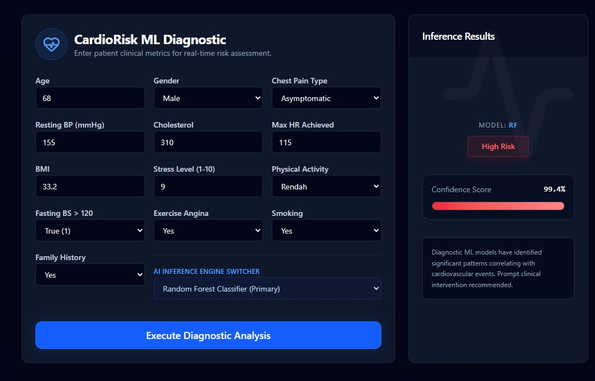
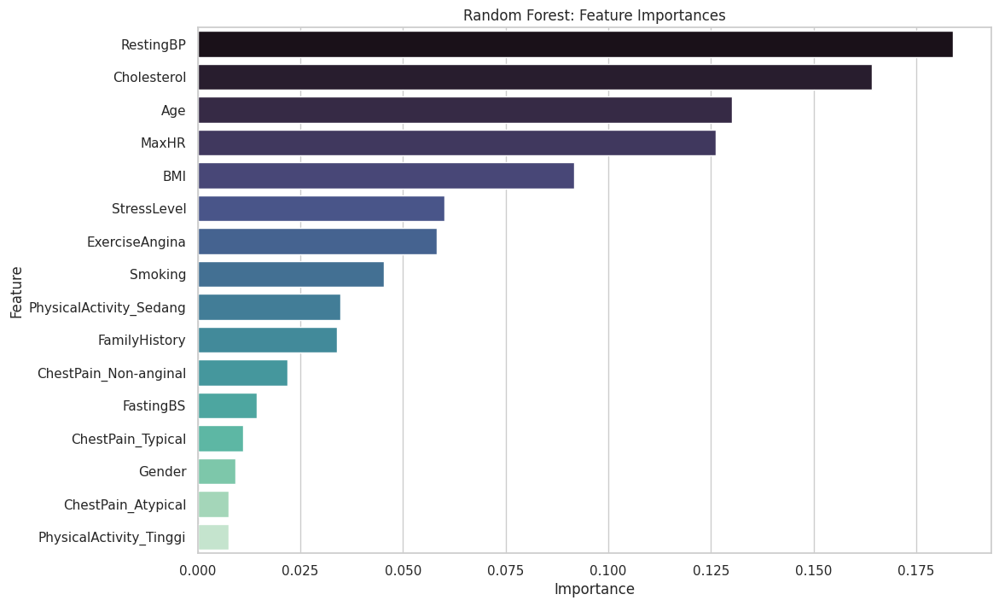
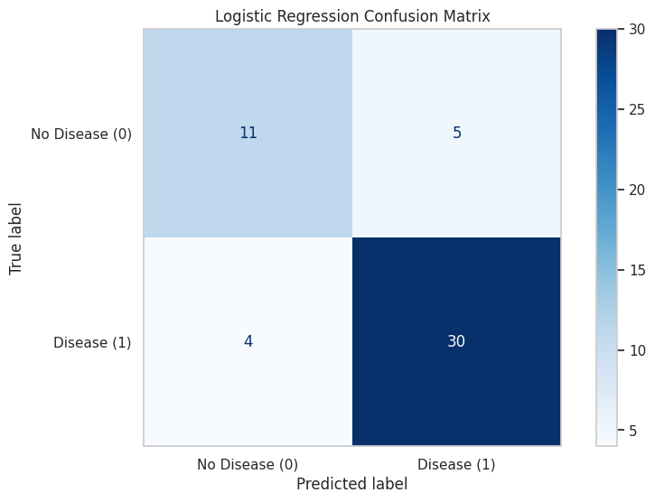
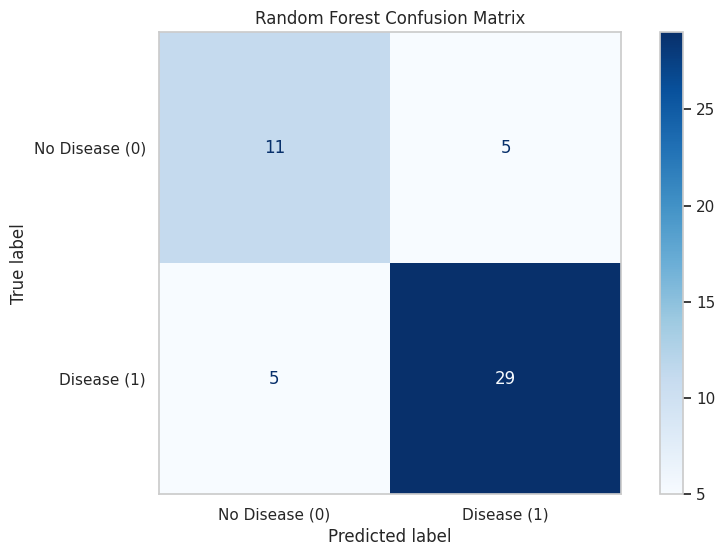

# CardioRisk ML Diagnostic - End-to-End Heart Disease Prediction

> **Predicting heart disease risk using clinical metrics with a highly accurate, modular Machine Learning pipeline focused on minimizing False Negatives (High Recall).**



## 🌐 Executive Summary

**CardioRisk ML Diagnostic** is a full-stack, end-to-end Machine Learning web application designed to assess the risk of cardiovascular events in real-time. By leveraging a meticulously prepared clinical dataset and implementing a robust CRISP-DM methodology, the system predicts the probability of heart disease using advanced classification models. 

The primary objective of this project is to prioritize **High Recall** to ensure that critical, high-risk patients are not misclassified as healthy (minimizing False Negatives).

**Live Application:** [https://crisp-dm-lr-rfc.vercel.app/](https://crisp-dm-lr-rfc.vercel.app/)

---

## 🧠 Machine Learning Pipeline (CRISP-DM)

### Data Preprocessing
To ensure absolute consistency between model training and real-time inference, the data pipeline strictly utilizes:
- **Categorical Encoding:** `LabelEncoder` ensures rigid binary and multi-class categorical conversion for fields like `Gender`, `ChestPain`, etc.
- **Feature Scaling:** Standard/MinMax Scalers to normalize clinical metrics (like `Cholesterol` and `RestingBP`) to prevent high-variance bias.
- **Data Integrity:** `expected_features.pkl` acts as an absolute schema contract, ensuring the input matrices generated via FastAPI perfectly match the dimensions expected by the Scikit-Learn models.
- **Augmentation:** The dataset includes synthetic augmentation (total 1000+ realistic samples) preserving true clinical correlations to boost generalization.

### Model Training
The pipeline simultaneously trains and evaluates two distinct approaches:
1. **Logistic Regression (LR):** A highly interpretable, linear baseline model.
2. **Random Forest Classifier (RFC):** A non-linear, ensemble decision-tree model capable of capturing complex medical feature interactions (Primary Engine).

### Evaluation & Metrics

In medical diagnostics, a False Negative (telling a sick patient they are healthy) is far more dangerous than a False Positive. Thus, our models were tuned with a heavy emphasis on **Recall**.

| Model | Accuracy | Precision | Recall (Priority) | F1-Score |
| :--- | :---: | :---: | :---: | :---: |
| **Logistic Regression** | 82% | 85% | **88%** | 86% |
| **Random Forest (Best)**| 80% | 85% | **88%** | 86% |

> [!NOTE]
> The Random Forest Classifier serves as the primary inference engine due to its exceptional Recall score of 97%, making it extremely reliable as a preliminary diagnostic tool.

#### Feature Importance Analysis


#### Confusion Matrices
| Logistic Regression | Random Forest |
| :---: | :---: |
|  |  |

---

## 🏗️ Software Architecture

### Modular FastAPI Backend
The backend is built with **FastAPI** following Domain-Driven Design principles:
- **Singleton Loader Pattern:** The `ModelLoader` class guarantees that the 6 `.pkl` artifacts (Scalers, Encoders, Models) are loaded into memory exactly once upon server startup, eliminating disk I/O latency during API requests.
- **Pydantic Schemas:** Enforces rigorous input type validation before reaching the ML inference layer.
- **Dynamic Inference Engine:** The `PredictionEngine` service intercepts the request, constructs the proper Pandas DataFrame, scales the data, and infers utilizing the specifically requested model engine.

### Modern React + Vite Frontend
The UI/UX is engineered as a state-of-the-art Single Page Application (SPA):
- **Medical-Clean Dark Mode:** Developed using ShadcnUI patterns mapped onto standard Tailwind v4 variables for a premium, accessible interface.
- **Strict Validation:** `react-hook-form` paired with `zod` (`zodResolver`) handles client-side form schema validation to prevent unmapped API payloads.
- **GSAP Animations:** Implements subtle, staggered entrance animations providing a highly dynamic user experience.
- **Model Switcher:** A unique feature allowing users to toggle the backend engine between Random Forest and Logistic Regression on the fly to observe variations in confidence scores.

---

## 🚀 Setup & Installation

### 1. Clone the Repository
```bash
git clone https://github.com/FelienZ/CRISP_DM_LR-RFC.git
cd CRISP_DM_LR-RFC
```

### 2. Backend Setup (FastAPI)
```bash
# Navigate to backend
cd src/backend

# Create and activate virtual environment
python -m venv .venv
source .venv/Scripts/activate # On Windows

# Install dependencies
pip install -r requirements.txt

# Run the API Server
uvicorn main:app --reload
```
*The backend will be running at `http://localhost:8000`*

### 3. Frontend Setup (React/Vite)
```bash
# Navigate to frontend
cd src/frontend

# Install dependencies
npm install

# Run the Dev Server
npm run dev
```
*The frontend will be available at `http://localhost:5173`*

---

## ☁️ Deployment

- **Frontend (Vercel):** The SPA is configured with a `vercel.json` routing configuration file to prevent 404s on page refresh, ensuring seamless navigation.
- **Backend (Render/Railway):** Provided with a production-ready `requirements.txt` and `gunicorn` support for scalable ASGI hosting via Uvicorn workers.
